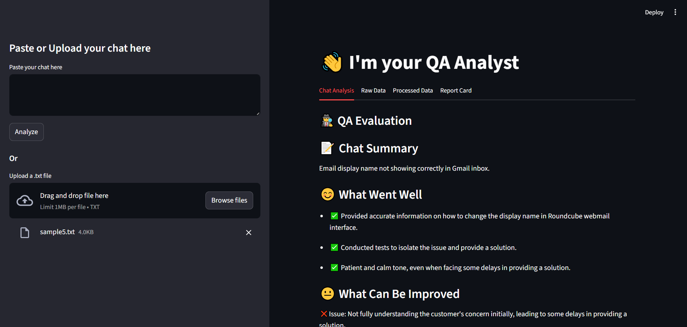
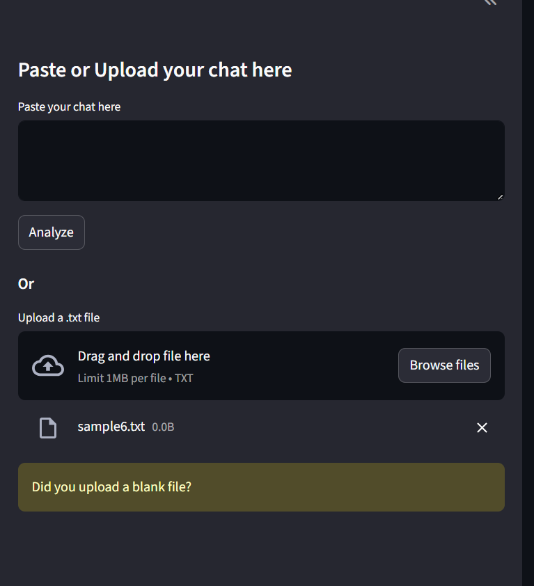
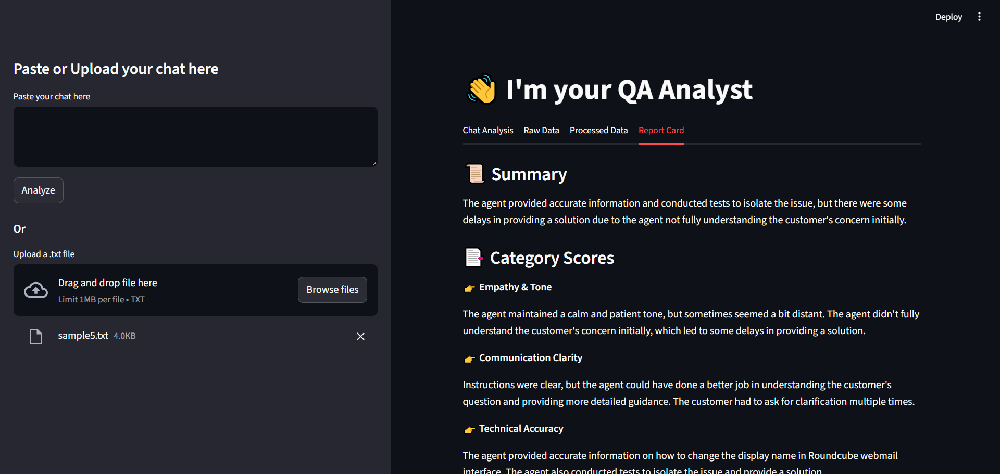

# 🤖 Chat-Analyst – Your Local QA Analyst for Customer Support

Chat-Analyst is a lightweight, privacy-conscious, AI-powered tool that evaluates customer-agent chat transcripts for soft skills like tone, empathy, and communication quality. Powered by open-source LLMs via Together.ai, it helps automate QA reviews—without ever storing your data.



---

## 🔍 What It Does

- ✅ Parses raw customer support chats (copy-paste or file upload)
- ✅ Preprocesses and formats the conversation
- ✅ Uses an LLM to provide structured QA feedback
- ✅ Displays raw, processed, and final evaluation reports
- ✅ Works locally with minimal setup—privacy first!

---

## 🚀 Features

- 🧠 AI-Powered QA Evaluation: Uses Meta Llama Vision via Together.ai for detailed analysis.
- 📝 Soft-Skill Assessment: Evaluates tone, professionalism, clarity, and flow.
- 📂 Paste or Upload: Accepts direct input or .txt files.
- 📊 Visual Output: Multiple tabs for chat, parsed data, and report card.
- 🔒 Privacy-First: No data is stored or logged.

---

## 🖼 Interface Screenshots

| Chat Upload & Preprocessing | Chat Analysis | Report Card View |
|-----------------------------|---------------------|--------------|
|  |  |  |

---

## 🛠 Installation

1. **Clone the repo:**
   ```bash
   git clone https://github.com/yourusername/chat-analyst.git
   cd chat-analyst

2. **Create and activate a virtual environment (optional but recommended):**
    ```bash
    python -m venv venv
    source venv/bin/activate  # or venv\Scripts\activate on Windows

3. **Install dependencies:**
    ```bash
    pip install -r requirements.txt

4. **Add your API key:**
    ```bash
    TOGETHER_API_KEY=your_together_api_key_here

## ▶️ Running the App
    streamlit run app.py

## 📂 Project Structure
    
    chat-analyst/
    │
    ├── app.py                 # Main Streamlit frontend
    ├── src/                   # Chat parsing and preprocessing
    ├── llm_engine/            # Feedback engine + LLM wrappers
    ├── prompts/               # Prompt templates
    ├── schemas/               # JSON structure for feedback
    ├── img/                   # UI screenshots
    ├── .env.template          # Template file for API key
    ├── requirements.txt       # Python dependencies
    └── README.md              # This file

## 📌 Notes

- 💡 If the model output is invalid or malformed, fallback handling will trigger.
- 🛡 This app never stores your chats—only processes in-memory.
- ⏱ Performance tested on chats up to ~5K tokens.

## 📃 License
MIT License. Feel free to fork, use, or contribute!

## 🙋‍♂️ Author
Built by Kuldeep Gupta.
📧 Contact: kuldeep.gupta2603@gmail.com